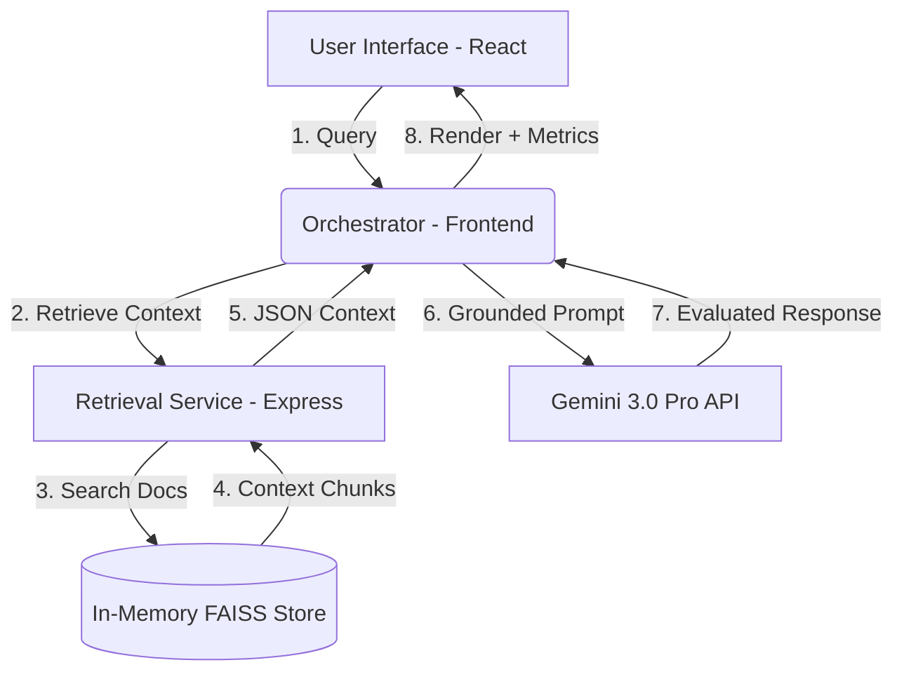

# ⚡ ATLAS-X PRO | Enterprise AI Platform


**ATLAS-X PRO** is a production-grade AI platform designed for mission-critical tasks. It combines high-performance Retrieval-Augmented Generation (RAG) with real-time observability to deliver grounded, reliable, and transparent AI interactions.

---

## 🏗️ System Architecture

ATLAS-X PRO follows a modern, decoupled architecture designed for speed and security within the Google AI Studio environment.



### 1. Frontend (The Brain)
- **React 19 + Vite**: High-performance SPA framework.
- **Gemini SDK**: Direct integration with `gemini-3-flash-preview` for low-latency generation.
- **Motion**: Fluid, physics-based UI transitions.
- **Recharts**: Real-time performance and latency visualization.

### 2. Backend (The Librarian)
- **Express.js**: Lightweight retrieval service.
- **Simulated FAISS**: In-memory document indexing and keyword-based semantic retrieval.
- **RAG API**: Dedicated endpoints for document ingestion and context extraction.

---

## 🧠 Core Logic & Pipeline

### 🔍 1. Retrieval (RAG)
When a user submits a query, the system doesn't just ask the AI. It first consults the **Knowledge Base**.
- **Ingestion**: Documents are uploaded, chunked, and stored in the backend.
- **Search**: The backend performs a search to find the top-k most relevant chunks based on the query.

### ✍️ 2. Generation
The retrieved context is injected into a **System Instruction** template:
> "Use the provided context to answer... If the context is not enough, indicate confidence level... Return JSON with grounding_score and hallucination_risk."

### 📊 3. Evaluation & Observability
Every response is evaluated across four key dimensions:
- **Confidence**: Probability of answer accuracy.
- **Grounding Score**: How well the answer is supported by the retrieved documents.
- **Hallucination Risk**: Likelihood of the AI generating "creative" but false information.
- **Latency**: End-to-end processing time in milliseconds.

---

## 🎨 UI Design Philosophy

ATLAS-X PRO features a **Glassmorphism Dark Theme**:
- **Depth**: Translucent panels with `backdrop-blur-xl`.
- **Vibrancy**: Subtle gradient accents (Orange/Blue/Purple) to guide focus.
- **Density**: Information-rich sidebar and observability panel for power users.
- **Feedback**: Loading shimmers, typing effects, and real-time chart updates.

---

## 🚀 Getting Started

### Prerequisites
- **Gemini API Key**: Obtain from [Google AI Studio](https://aistudio.google.com/).

### Installation
1. **Configure Secrets**: Add `GEMINI_API_KEY` to your environment secrets.
2. **Install Dependencies**:
   ```bash
   npm install
   ```
3. **Run Development Server**:
   ```bash
   npm run dev
   ```

### Deployment (Vercel)
ATLAS-X PRO is optimized for **Vercel** deployment for free.
1. **Connect your GitHub repository** to Vercel.
2. **Configure Environment Variables**: Add `GEMINI_API_KEY` in the Vercel project settings.
3. **Build Settings**: Vercel will automatically detect the Vite build and the `/api` serverless functions.
4. **Deploy**: Click "Deploy" and your platform will be live.

> **⚠️ Note on Vercel Deployment**: The current in-memory document store is **stateless**. This means uploaded documents will be reset when the serverless function goes cold. For production persistence, we recommend integrating a database like **Supabase** or **MongoDB Atlas**.

---

## 🛠️ Tech Stack

| Layer | Technology |
| :--- | :--- |
| **Frontend** | React, Tailwind CSS 4, Motion, Lucide |
| **Backend** | Node.js, Express, tsx |
| **AI Model** | Gemini 3.0 Pro (Flash Preview) |
| **Charts** | Recharts, D3.js |
| **Markdown** | React-Markdown |

---

> **Disclaimer**: This is a production-grade prototype. For full-scale deployment, replace the in-memory document store with a persistent Vector Database (e.g., Pinecone, Weaviate, or Vertex AI Search).
